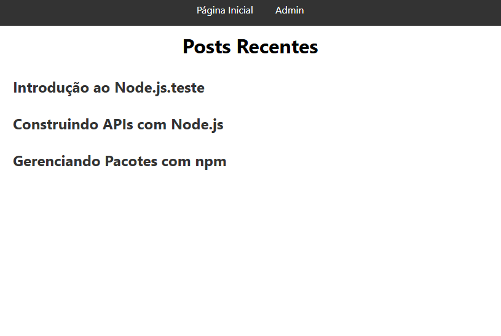
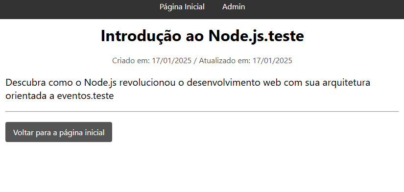
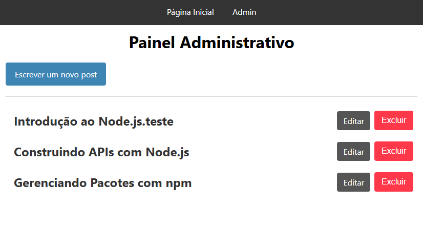
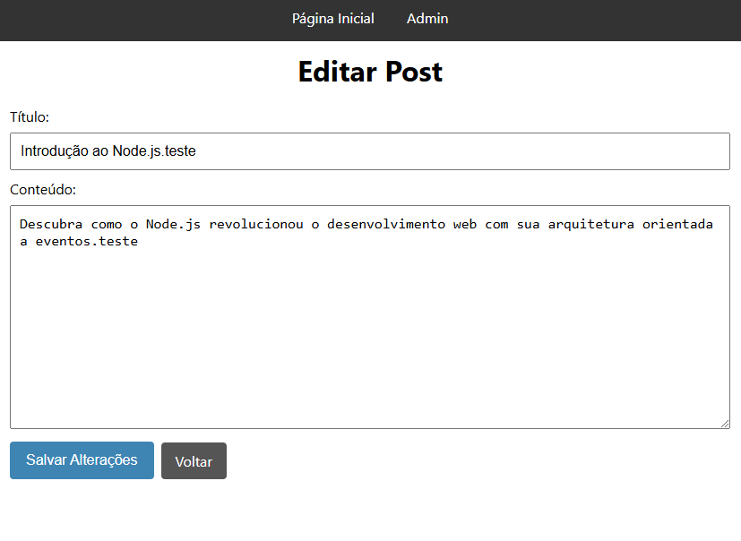

# Blog Model

Blog Model é um projeto prático para estudos de backend, utilizando as tecnologias Express, Node.js, CSS, HTML, EJS e o modelo de organização MVC.






## Funcionalidades

- 🏠 Página inicial com listagem de posts
- 📄 Visualização de posts individuais
- ✏️ Painel administrativo para criação, edição e exclusão de posts
- 📱 Design responsivo para diferentes dispositivos

## Tecnologias Utilizadas

- Express
- Node.js
- CSS
- HTML
- EJS

## Organização das Pastas

- `server.js`
- `router.js`
- `controllers/`
  - `postController.js`
  - `adminController.js`
- `models/`
  - `postModel.js`
- `views/`
  - `index.ejs`
  - `post.ejs`
  - `partials/`
    - `header.ejs`
    - `footer.ejs`
  - `admin.ejs`
  - `newPostForm.ejs`
  - `editPostForm.ejs`
- `public/`
  - `assets/`
    - `style.css`
    - `script.js`

## Como Executar o Projeto

1. Clone o repositório:

    ```bash
    git clone https://github.com/seu-usuario/blog-model.git
    cd blog-model
    ```

2. Instale as dependências:

    ```bash
    npm install
    ```

3. Execute o projeto:

    ```bash
    npm run dev
    ```

4. Abra http://localhost:3000 no seu navegador para ver a aplicação em execução.

## Aprendizados

Este projeto foi uma excelente oportunidade para:

- 🔷 Aprofundar conhecimentos em Express e Node.js
- 🔷 Praticar o uso de EJS para renderização de páginas
- 🔷 Implementar design responsivo com CSS
- 🔷 Criar uma aplicação seguindo o modelo de organização MVC

## Contribuições

Contribuições são bem-vindas! Sinta-se à vontade para abrir uma issue ou enviar um pull request.

## Licença

Este projeto está sob a licença MIT. Veja o arquivo LICENSE para mais detalhes.

## Contato

**M Daniel Dantas**

- **GitHub:** [mdanieldantas](https://github.com/mdanieldantas)
- **LinkedIn:** [mdanieldantas](https://www.linkedin.com/in/mdanieldantas)
- **Portfólio:** [Portfólio de Daniel Dantas](https://danieldantasdev.vercel.app)
- **Email:** [contatomarcosdgomes@gmail.com](mailto:contatomarcosdgomes@gmail.com)
<!-- - **Link do Projeto:** [calculator](Linkdo do projeto) -->
- **Currículo:** [Baixar Currículo](https://drive.google.com/file/d/1Z_tqBv6kg4wkDAQHAvY3lcuVSq3rabTt/view?usp=drive_link)
<!-- - **Veja Online:** [Nome do projeto](link) -->